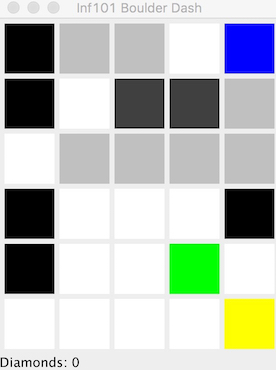

[Semesteroppgave 1: Boulder Dash](https://retting.ii.uib.no/inf101/inf101v17/wikis/sem-1)
===

*Innleveringsfrist: Mandag 27. mars kl 2400*

## Om semesteroppgaven

Semesteroppgaven er *obligatorisk*, og er ment å gi innsikt i og erfaring med
teknikkene vi har lært hittil i semesteret, og å teste en del praktiske
ferdigheter som ikke er så lette å teste på eksamen. Se under angående
karakter. 

*Les helst all den kjedelige teksten før du begynner. Si ifra om noe er veldig uklart.*

### Læringsmål

Målene for denne semesteroppgaven er:

* Å kunne sette seg inn i et eksisterende program/rammeverk, og utvide det ut ifra spesifikasjoner (beskrivelsen i oppgavene).
* Å bruke grensesnitt (interface) til å kommunisere mellom objekter.
* Å lage programmer hvor objektene selv styrer sin egen oppførsel, basert på *hendelser* i systemet.
* Å beskrive komplekse objekt-orienterte systemer på en forståelig måte.

Semesteroppgaven blir rettet av en gruppeleder, som gir tilbakemeldinger på
innleveringen. For semesteroppgavene blir det satt poeng, og til sammen teller
semesteroppgavene 30 % på karakteren i faget. Ved poengsetting legger vi vekt
på følgende:

* At du har fungerende løsninger på de forskjellige deloppgavene
* At koden din er ryddig, pent formattert, og at eventuelle deler som er vanskelig å forstå er forklart i kommentarer
* At du har laget tester for koden din
* Kreativitet, og at du gjør mer enn minimum for å fullføre oppgaven

Du kan regne med en godt gjennomført innlevering som oppfyller minimumskravene gir en
poengsum ca. tilsvarende C. For høyere poengsum må man ha gjort en del av bonusoppgavene. Manglende /
svært mangelfull innlevering gir 0 poeng.

### Samarbeid

Innleveringen er individuell og kan ikke løses i grupper. Dere står likevel fri
til å samarbeide om utarbeiding av ideer, diskutere løsninger og å hjelpe
hverandre med å finne og løse problemer (vi oppfordrer faktisk til det!).

### Innlevering

Oppgaven leveres inn ved å pushe til GitLab (Team → Commit → Commit and push).
[Se instruksjonene fra Lab 1](lab-1). Husk å få med eventuelle nye filer du har
opprettet (hvis testene virker hos deg, men ikke i innleveringssystemet, er det
gjerne det som er feil).

Som før skal du ha et repository for oppgaven på retting.ii.uib.no. Se [Lab
1](lab-1) for mer informasjon og instrukser. Oppgaven skal dere kunne finne i
repositoriet med den følgende urien:

    https://retting.ii.uib.no/<brukernavn>/inf101.v17.sem1.git

Hvor `<brukernavn>` skal byttes ut med brukernavnet ditt på retting.ii.uib.no. Merk at
det er nødvendig å bruke https (ssh vil ikke fungere).

Som vist på forelesningene, for å få dette prosjektet inn i eclipse, velg
`import` fra fil menyen.  Velg så `Git` -> `Projects from git` -> `Clone URI`.
Fyll in URIen som du finner over. (Eclipse fyller så ut *host* og *repository
path* med `retting.ii.uib.no` og `/<brukernavn>/inf101.v17.<oppgavenavn>.git`.

Skriv inn ditt brukernavnet og GitLab-passord, og trykk `next`. Nå velger du hvilken
branch du skal ha (`master` og `clear`). Trykk på `next`. Neste ting er å velge en mappe å
putte repositoriet under `Directory`, og la resten være slik det er (initial
branch: `master`, Remote name: `origin`), `next` -> `import existing project`
-> `next` -> `finish`.

Nå skal du ha et prosjekt i eclipse som heter `inf101.v17.sem1`.

Merk at innlevering skal skje til dette repositoriet. For å levere bruker du
`Team` -> `Push` (husk at du må bruke `commit` først), eventuelt `Team` ->
`Commit` og så `Commit and Push`. *Husk* at hvis du har opprettet nye
klasser/filer, må du krysse av for disse i commit-dialogen for at de skal bli
med i opplastingen.

**VIKTIG:** *Sjekk kvitteringssiden som kommer opp når du pusher, i tilfelle det skjer feil!*

Vi anbefaler at du gjør commit hver dag, eller hver gang du er ferdig med en
større endring. Da går det alltid an å lete seg tilbake i historien til en
tidligere versjon hvis du har havnet på villspor (commit-dialogen inneholder
også en praktisk "Commit and push"-knapp, som pusher endringene til GitLab med
en gang).


* Du kan levere inn så mye og ofte du vil. Versjonen som teller er den siste du
  pushet før innleveringsfristen.

* *VIKTIG:* Hvis du ikke allerede har prøvd ut GitLab og pushing av
  innleveringer, må du gjøre det *tidlig*. Du kan ikke regne med å få hjelp til
  dette på innleveringsdagen, men på gruppetimene vil du få rikelig med hjelp
  til dette.

* Alle testene bør passere (være grønne). Det blir i tillegg lagt betydelig
  vekt på kodekvalitet og dokumentasjon. Dvs. koden din skal ikke bare *virke*,
  den være lett å forstå og å endre.

* Du kan selv sjekke status i
  [innleveringssystemet](http://retting.ii.uib.no:81/) – det vil gi rask
  tilbakemelding hver gang du pusher til Gitlab, også før innleveringsfristen.
  Alt skal være *grønt* der.

### Tips

* Selv om det kanskje bare er litt mer å gjøre enn i en vanlig ukeoppgave, er
  det veldig mye å sette seg inn i. Du bør begynne tidlig og jobbe jevnt. Du må
  også regne med å jobbe utenom labtimene.


# Boulder Dash


Boulder Dash er et gammel NES-spill der du graver ut en gruve, samler diamanter
og dreper monstre før de dreper deg. Semesteroppgaven går ut på å gjøre ferdig,
beskrive, og eventuelt utvide, en implementasjon av spillet.



Du styrer en spiller (gruvearbeider) som navigerer sand, steiner og monstre,
ved hjelp av piltastene. Brettet er vertikalt, så steiner faller nedover, men
spilleren og monsteret kan klatre i alle retninger. Vårt spill har ett nivå, og
består av et kart (map) med seks typer felter, i tillegg til spilleren:
* *Tomt* område (hvitt): alt kan bevege seg fritt gjennom tomme områder.
* *Vegg* (svart): ingenting kan bevege seg gjennom vegger.
* *Sand* (lys grå): kun spilleren kan bevege seg gjennom et område med sand.
  Dersom spilleren går gjennom et område med sand blir den *tom* etterpå.
* *Stein* (mørk grå): ingenting kan bevege seg gjennom steiner. Steiner faller
  dersom ingenting (sand, stein, vegg, gulv) støtter opp under dem. Dersom en
  stein faller på en spiller eller et monster dør de. Dersom en stein faller på
  sand, stein, vegg eller gulv, blir den liggende. Du kan dytte steiner til
  høyre eller venstre ved å gå inn feltet deres.
* *Diamant* (gul): oppfører seg som stein, med unntak av at du kan plukke dem
  opp. Hvis du beveger deg gjennom et område med diamant blir det tomt, og du
  øker diamant-antallet ditt med én.
* *Monster* (grønn): monster er fæle! De beveger seg heldigvis i en fastsatt
  bane, men dersom spiller og monster er i samme felt dør spilleren. Hvis
  monsteret blir truffet av en fallende stein dør det, ved å eksplodere og
  fylle området rundt med diamanter som du deretter kan plukke opp.

For fullstendig beskrivelse av det originale spillet se
[her](https://totalmentegame.wordpress.com/boulder-dash-rules-of-the-game/),
med eksempel-spilling [her](https://www.youtube.com/watch?v=FiEVfa1OK_o). Vi
skal lage en litt enklere versjon.  Dersom du leser den lange guiden, legg
merke til forskjellene:
* Steiner og diamanter triller ikke: de faller rett ned og blir liggende der.
* Vi har ikke andre kontroller enn piltastene: å plukke opp diamanter skjer av
  seg selv.
* Vi har bare ett nivå, og det har ingen våpen.
* Monster eksploderer kun til diamanter, og ødelegger ingenting rundt seg når
  det skjer.


## Generell implementasjonsdetaljer
* Hvert felt inneholder et objekt som er enten Stein (BDRock), Sand (BDSand), Vegg (BDWall), Tomt (BDEmpty), Diamant (BDDiamond), Monster (BDBug) eller spilleren (BDPlayer).
* Spillet skjer stegvis. Det grafiske grensesnittet ber alle objekter i hvert
  felt om å gjøre et steg med jevne mellomrom.
* Hvert objekt har en `step()` metode som blir kalt for hvert steg hvor objektet gjør de oppdateringer den ønsker å gjøre
  som å drepe et objekt den faller på (Stein sin oppførsel) eller å flytte på seg (Spiller, monster, stein og diamant).
* Hvis en trykker på en piltast blir ikke spilleren flyttet med en gang, men man forbereder seg på å flytte og så neste gang `step()` metoden
  blir kalt så blir `BDPlayer` objektets posisjon oppdatert.
* Objektene er hold i et `DBMap` i likhet til labyrint oppgaven.

# Steg 0

Som før skal du ha et repository for oppgaven på retting.ii.uib.no. Se [Lab
1](lab-1) og [Lab 2](lab-2) for mer informasjon og instrukser. Oppgaven skal dere kunne finne i
repositoriet med den følgende urien:

    https://retting.ii.uib.no/<brukernavn>/inf101.v17.Semesteroppgave1.git

# Steg 1 Få en oversikt over koden

## Code Overview
* inf101.v17.boulderdash.bdobjects - Objektene som hvert felt består av
* **inf101.v17.boulderdash.bdobjects.IBDObject** - Interfacet som hvert objekt i et felt må bestå av
* inf101.v17.boulderdash.bdobjects.IBDMovingObject - Interface for et objekt som flytter seg (f.eks. player eller bug) [extends IBDObject]
* inf101.v17.boulderdash.bdobjects.IBDKillable - Interface for et objekt som kan drepes (f.eks. player eller bug)
* inf101.v17.boulderdash.bdobjects.AbstractBDObject - Abstrakt klasse som implementerer felles oppførsel for alle felt-objektene.  [implements IBDObject]
* **inf101.v17.boulderdash.bdobjects.AbstractBDMovingObject** - Abstrakt klasse som implementerer felles oppførsel for bevegende objekter [extends AbstractBDObject, implements IBDMovingObject]
* inf101.v17.boulderdash.bdobjects.AbstractBDKillingObject - Abstrakt klasse som implementerer felles oppførsel for felt-objekter som dreper ting når de beveger seg over det. [extends AbstractBDMovingObject]
* inf101.v17.boulderdash.bdobjects.AbstractBDFallingObject - Abstrakt klasse for objekter som faller (f.eks. steiner og diamanter) [extends AbstractBDKillingObject]
* inf101.v17.boulderdash.bdobjects.BDBug - Et Monster [extends AbstractBDKillingObject, implements IBDKillable]
* inf101.v17.boulderdash.bdobjects.BDDiamond - En Diamond [extends AbstractBDKillingObject]
* inf101.v17.boulderdash.bdobjects.BDEmpty - Et tomt felt [extends AbstractBDObject]
* **inf101.v17.boulderdash.bdobjects.BDPlayer** - Spilleren [extends AbstractBDMovingObject, implements IBDKillable]
* **inf101.v17.boulderdash.bdobjects.BDRock** - Stein felt-objektet [extends AbstractBDFallingObject]
* inf101.v17.boulderdash.bdobjects.BDSand - Sand felt-objektet [extends AbstractBDObject]
* inf101.v17.boulderdash.bdobjects.BDWall - Vegg felt-objektet [extends AbstractBDObject]
* **inf101.v17.boulderdash.maps.BDMap** - Kartet som inneholder alle felt-objektene i et grid
* inf101.v17.boulderdash.maps.gui - GUI-relaterte kode.

# Steg 2 Lag en oversikt over systemet
## Steg 2.1 Bli litt kjent

* Kjør programmet (Main-klassen). Du kan bytte mellom fullscreen og vindu ved å trykke 'f',
og avslutte ved å trykke 'q' eller ESC. Foreløpig fungerer ikke spillet i det hele tatt, du kan bare se et kart.
* Finn ut hvor fargene kommer fra, og bytt farge på sanden til f.eks. `Color.SANDYBROWN` eller en annen farge du liker. 
* Se på `maps`-pakken. Finn metoden som oversetter mellom tegn ('*', '#', 'p', osv) og BD-objekter – dette er en såkalt [factory-metode](https://en.wikipedia.org/wiki/Factory_method_pattern).
Legg til et tilfelle som lager en BDDiamond for tegnet 'd'. Kjør programmet igjen og se at du får gule diamanter på skjermen. (Bytt gjerne farge på diamantene også)
* Gå inn i Main-klassen og prøv forskjellige kart. Det ligger ved tre kart i tekstfiler, `level1.txt` er en omtrentlig kopi fra det originale spillet.

## Steg 2.2 Beskriv systemet
Beskriv hvordan programmet er organisert med dine egne ord. Dette kan også inkludere diagrammer for
å beskrive strukturen til koden. Tegn gjerne på papir først mens du jobber med å få oversikt.

* Studer filene i inf101.v17.boulderdash.bdobjects først
* 1. Hvilke interface finnes? Hva er sammenhengen mellom dem og hva brukes de til?
* 2. Hva slags rolle spiller arv i designet til programmet?
* 3. Det er flere abstrakte klasser i systemet. Hva slags funksjon har de? Hvorfor er de abstrakte?
* 4. Hvor er hoveddelen av logikken til spillet er implementert? Få oversikt over metodene, hvor de er implementert, hvordan de kalles.
* 5. Hva slags rolle spiller abstraksjon i dette programmet?
* 6. Hvordan kunne man lagt til en ny type felt?
* 7. Hvordan er det implementert at en diamant faller?

Denne beskrivelsen burde legges til i innleveringen din, enten ved å fylle tekst i `OVERVIEW.md`, eller ved å legge
til PDF-dokumenter eller bilder (du kan legge til filer i Eclipse-prosjektet med *Import → General → File System*). 
Bruk git til å legge til disse filene
i repositoriet ditt og push det til retting.uib.no sammen løsningen din til resten av oppgaven.


# Steg 3

I dette steget skal du fullføre implementasjonen av spillet.

## Steg 3.1 Implementer `getPosition(IBDObject obj)` i BDMap
`BDMap` blir brukt til å lagre posisjonen til alle objektene i et grid. Klassen har `get`-metoder slik at du kan finne objektet som ligger på en gitt posisjon.
I flere tilfeller (du kan finne ut hvor ved å velge metoden i Eclipse, og så kjøre *Navigation → Open Call Hierarchy* fra menyen) trenger vi også å finne posisjonen gitt et objekt – til det trenger vi `getPosition()`-metoden som du nå skal implementere.

`BDMap` holder alle objektene i et grid, `IGrid<IBDObject> grid`. Metoden `getPosition()` må gå gjennom hver `x` og `y` koordinat
i gridet, for å finne objektet vi leter etter, og returnere posisjonen. Hvis objektet ikke finnes i gridet må skal den
returnere `null`.

### Bonus points
Denne metoden kan bli implementert mye mer effektivt ved hjelp av et [hashmap](http://www.codejava.net/java-core/collections/java-map-collection-tutorial-and-examples),
som lagrer posisjonene med objektene som søkenøkkel.
Legg til et`HashMap<BDObject,Position>` som en ny feltvariabel. Når et objekt legges til eller endrer posisjon, bruker du `put`
for å assosiere objektet med posisjonen i hashmap-et. Tilsvarende kan du bruke `get` for å slå opp posisjonen til et objekt.

### Spørsmål

* Hvorfor trenger vi `getPosition`-metoden? Kunne vi like gjerne ha lagret posisjonen i hvert enkelt objekt?
* Hvis vi bruker et hashmap til å forenkle jobben med å finne posisjoner, har vi laget en sammenheng mellom
to av feltvariablene; grid-et og hashmap-et. Hva er sammenhengen? (Her har vi en [*datainvariant*](https://retting.ii.uib.no/inf101/inf101v17/wikis/forelesninger/1415-forkravinvariant),
en begrensing på datarepresentasjonen i objektet.)
* Ville vi fått en tilsvarende sammenheng mellom grid-et i BDMap og BD-objektene våre om vi lagret posisjonen i hvert enkelt objekt? Kan det være problematisk?

## Steg 3.2 Implementer step()-metoden

Implementer `step()`-metoden i `BDMap`. Den skal gå gjennom hver koordinat i gridet, og kjøre `step()` på objektet som er lagret der.
Når du har fikset det, bør du kunne se den grønne buggen bevege seg rundt i `testMap.txt`. (Du kan fremdeles ikke
flytte spilleren før du har gjort 3.4.)

## Steg 3.3 En liten test

Kikk på testene i `inf101.v17.boulderdash.bdobjects.tests`. Disse testene følger et enkelt prinsipp:

* Sett opp et testscenario, med et kart med noen få objekter på.
* Kjør noen få steg, og se at objektene beveger seg som forventet

Dette er typiske eksemeplbaserte tester. Se på testen i `BugTest`; den sjekker at i løpet av hundre steg vil en uhindret BDBug bevege seg
minst ett steg. Utvid denne litt med flere testmetoder:

* Lag en testmetode til hvor buggen er innelåst av vegger ('*'), og se at den ikke beveger seg da; tilsvarende for sand ('#').
* Lag en test hvor du sjekker at den nye posisjonen til buggen er som forventet (buggene beveger seg WEST, NORTH, EAST, SOUTH).
* Lag en test til hvor spilleren ('p') står i veien for buggen. Sjekk at spilleren har blitt drept etter en del steg (map.getPlayer().isAlive()).

(Buggene beveger seg med en del stegs mellomrom, så du må gjerne kjøre step i en løkke slik det er gjort i de eksisterende testene.)

## Steg 3.4 Implementer BDRock

Vi trenger et `BDObject` som oppfører seg som en stein i spillet. Vi har allerede
`AbstractBDFallingObject` som er en abstrakt klasse som implementerer oppførselen til
et fallende objekt. `BDRock` skal arve fra `AbstractBDfallingObject` med følgende oppførsel:

* Steiner kan `push()`-es `EAST` eller `WEST` if feltet vi dytter mot er tomt (BDEmpty).
(To steiner som ligger ved siden av hverandre kan ikke dyttes, siden det da ikke er noe tomt felt.)

Lag en ny klasse `BDRock extends AbstractBDFallingObject` med følgende:

* En konstruktør `BDRock(IBDMap owner)` som kaller konstruktøren til superklassen (`super(owner)`)
* Metoden `Paint getColor()`: returnerer fargen (f.eks. `Color.DARKGRAY`)
* Metoden `push(Direction dir)`: dytter steinen basert på logikken beskrevet over. Den skal gjøre følgende:
    * Sjekke at retningen er enten EAST eller WEST, og kaste en exception om ikke
    * Finne posisjonen på feltet steinen skal dyttes inn i
    * Sjekke at det nye feltet er gyldig ved hjelp av `owner.canGo()`, og sjekke at feltet er `BDEmpty`
      (bruk `instanceof` for å sjekke at om et objekt er av en spesifikk klasse/interface – `target instancecof BDEmpty`).
    * Kall `prepareMove()` fra `AbstractBDMovingObject` for å flytte steinen til den nye posisjonen. Dette vil sette opp ting
      slik at steinen flytter seg ved neste tidssteg.
    * Returnere `true` hvis steinen ble flyttet og `false` ellers.
* Oppdater `BDMap` slik at den lager et `BDRock`-objekt når kartet har et `r`-tegn.

Se på testene i FallingTest (de bruker nå diamanter 'd'), og lag kopi av testmetodene som tester med stein ('r') i stedet.
Kommer du på flere gode testscenarier? Du bør *minst* lage en test hvor du sjekker at `push` fungerer som den skal.

## Step 3.5 Implementer `keyPressed()` og `step()` i `BDPlayer`

### Key Pressed

Metoden `keyPressed()` i `BDPlayer` tar et `KeyCode`-object, og kalles hver gang spilleren
trykker på en tast. Knappen indikeres med KeyCode-en. F.eks. vil følgende kode sjekke om 
venste-tasten ble trykket, og sette `askedToGo = Direction.WEST`:


    public void keyPressed(KeyCode key) {
		if (key == KeyCode.LEFT) {
			askedToGo = Direction.WEST;
	}

Gjør ferdig denne metoden så den setter askedToGo til `EAST`, `NORTH`, eller `SOUTH` når spilleren trykker `RIGHT`, `UP`, eller `DOWN`.

(Dette er typisk *event-drevet programmering* hvor metoder i programmet vårt blir kalt når
ting skjer utenfor programmet. Dette er vanlig for spill og programmer med grafiske brukergrensesnitt – man har
en metode som blir kalt for hvert tidssteg, og metoder som blir kalt når tastatur eller mus brukes.)

### Step-metod

Hvert `BDObject` har en `step()`-metode som blir kalt med jevne mellomrom for hvert objekt på kartet (ca 8 ganger i sekundet).
For `BDPlayer` skal metoden gjøre følgende: 

* Spør kartet (`owner`) om posisjonen
* Hvis `askedToGo != null` har brukeren med om bedt om å flytte, og vi skal gjøre:
    * Finn feltet vi skal flytte til og sjekk om det går an å flytte seg dit (`owner.canGo()`), og evt se hva slags felt det er:
    * Hvis vi flytter inn i en BDDiamond, skal vi øke `diamondCnt`
    * Hvis vi flytter inn i en BDRock i retningen `EAST` or `WEST`, må vi kalle `push` metoden og se om vi klarer å flytte steinen. (Om
      ikke, kan vi ikke flytte oss likevel)
    * Hvis vi flytter inn ien BDBug dør spilleren (`kill()`)
    * Hvis vi flytter inn i BDSand eller BDEmpty er det bare å flytte
    * Som tidligere skjer flytting ved å kalle `prepareMove(nyPosisjon)` – selve flyttingen vil så bli tatt hånd om automatisk av superklassen
* Til slutt må vi sette `askedToGo` til `null` (i påvente av ny input fra brukeren) og kalle `super.step()`.

### Tester

Lag en testklasse `PlayerTest`. Den kan kanskje likne litt på `BugTest`. Tenk ut noen testscenarier hvor spilleren beveger seg (f.eks. dytter en stein,
plukker opp en diamant osv.). Lag testmetoder for disse. 

* Husk at du kan kontrollere spilleren fra testen ved å kalle feks 'player.keyPressed(KeyCode.LEFT)'.
* Husk at du må kalle `step`-metoden for at spilleren faktisk skal flytte på seg.


## Steg 3.6 Oppdater beskrivelsen av systemet basert på erfaringene dine

# Steg 4 Bonus-oppgaver
Du bør gjøre noen av disse for å kunne oppnå topp-score. Du kan evt gjøre andre utvidelser om du har gode ideer selv.

## Idé 4.1: AI for BDPlayer

Du kan prøve å erstatte player-objektet med et som ignorerer tastetrykk og beveger seg på egenhånd. Du kan gjøre dette slik:

 * Lag en klasse `AIBDPlayer extends BDPlayer`.
 * Overstyr `keyPressed` så den ignorerer tastetrykkene.
 * I step-metoden, finn en retning vi ønsker å gå i (i verste fall velg en tilfeldig retning), og sett `askedToGo` til denne retningen. Kall `super.step()`, 
   den vanlige BDPlayer-klassen tar hånd om resten.
 * Prøv å finne en lur måte å velge hvor AI-spilleren skal gå. Du trenger antakelig å studere kartet i alle fire retninger for å finne ut hvor du *kan* gå, og
   om det er lurt å gå dit (f.eks. ikke gå SOUTH hvis vi har en stein i retning NORTH). En mulighet er å følge samme retningen, og så snu når man treffer noe.
 * Det er ikke så vanskelig å lage en veldig enkel AI-spiller som bare går ganske tilfeldig rundt – men å lage en som faktisk klarer å spille spillet er veldig
   vanskelig så vi forventer ikke at dere får til det (blant annet må man bruke en del stifinningsalgoritmer som dere ikke har lært).

## Idé 4.2: Fancy Rocks
Hvis to steiner er stablet oppå hverandre, med ledig rom på en eller begge sider, så skal egentlig den øverste steinen falle ned:
```
 r 
 r    ->   rr
***        ***
```

Implementer dette. Regelen er (sånn ca):

* En stein "faller" til siden (WEST eller EAST) om feltet ved siden av *og* på skrå nedenfor er tomme. Hvis det er ledig på begge sider (som i eksemplet over) skal steien falle en
en tilfeldig retning. Hvis feltet rett under steinen er sand, skal den *ikke* falle (den faller altså bare om den ligger oppå en annen stein, diamant eller vegg).
* Regelen gjelder egentlig for alle fallende objekter, diamanter også. Du gjør implementeringen ved å oppdatere `step()`-metoden i `AbstractBDFallingObject`.

[Se forøvrig regelbeskrivelsen her](https://totalmentegame.wordpress.com/boulder-dash-rules-of-the-game/)

## Idé 4.3: Fancy Images
Du kan få spillet til å se mye bedre ut ved å bruke bilder i stedet for farger. I stedet for å returnere en Color i `getColor` kan du bruke en [ImagePattern](https://docs.oracle.com/javase/8/javafx/api/javafx/scene/paint/ImagePattern.html).
Dette er også en JavaFX `Paint`, som GUI-en kan bruke til å fylle feltene med. (Andre paint-alternativer er gradienter)

Om du ikke er flink til å tegne selv, kan du finne glimrende grafikk på [OpenGameArt](http://opengameart.org/) – **husk å skrive i oversiktsdokumentet hvor du har fått 
grafikken fra** (webside, opphavsperson, copyright-lisens – om du bruker OpenGameArt, finner du opplysningene i *License(s)* og *Copyright/Attribution Notice*).

## Idé 4.4: Create more maps
Keep in mind when designing a map that it should be possible to solve it. A map cannot be solved when there is a diamond that cannot be reached by the player in any way.

(Du kan også prøve å lage en map-generator.)


