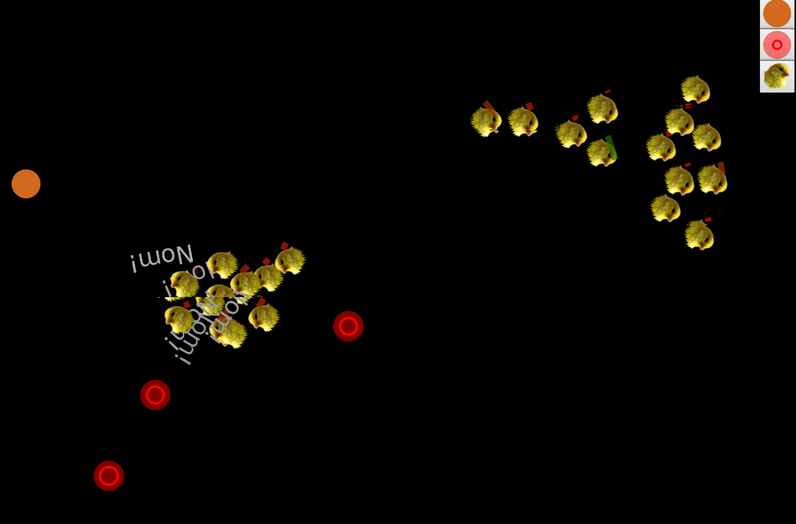

# Semesteroppgave 2 – 101-meterskogen

## Innleveringsfrist: 12. mai 2017 23:59:59 ([AoE](https://www.timeanddate.com/countdown/to?iso=20170512T235959&p0=3399&msg=INF101%20Semesteroppgave%202&font=sanserif&csz=1))
## Læringsmål

Målene for denne semesteroppgaven er:

* Å få erfaring med å ta egne designvalg, i stedet for å bare følge en oppskrift.
* Å utarbeide tester på egenhånd.
* Å gjøre bruk av arv og abstrakte klasser.
* Å lage enkel dokumentasjon og forholde seg til opphavsrett.
* Bli kjent med en del design patterns, som Factory, Observer/Listener, Singleton

I denne oppgaven står du veldig fritt til å gjøre som du vil, i motsetning til tidligere oppgaver du har fått i programmering. Hvis du er usikker på hva som er "riktig", må du først og fremst prøve å ta en avgjørelse selv – og beskrive den i den medfølgende OVERVIEW-filen.

## Sjekkliste før levering:

* Oversiktsdokument (OVERVIEW.md – eventuelt txt eller pdf)

* Kilde / rettigheter til bilder

* Klasseoversikt

* Beskrevet feil / mangler

* Beskrevet klassehierarki

* Beskrevet oppførselen / spillereglene

* Pushet besvarelsen – inkl alle nye filer (klasser, bilder, osv)

* Prosjektet lagret i UTF-8

* Sjekk [autosjekksystemet](http://retting.ii.uib.no:81/me) – at prosjektet kompilerer og testene kjører

## Innlevering

Oppgaven leveres inn ved å pushe til GitLab (Team → Commit → Commit and push). [Se instruksjonene fra Lab 1](https://retting.ii.uib.no/inf101/inf101v17/wikis/lab-1). Husk å få med eventuelle nye filer du har opprettet (hvis testene virker hos deg, men ikke i innleveringssystemet, er det gjerne det som er feil).

Som før skal du ha et repository for oppgaven på retting.ii.uib.no. Oppgaven skal dere kunne finne i repositoriet med den følgende
urien:

    https://retting.ii.uib.no/<brukernavn>/inf101.v17.sem2.git

Hvor `<brukernavn>` skal byttes ut med brukernavnet ditt på retting.ii.uib.no. Merk at
det er nødvendig å bruke https (ssh vil ikke fungere).

* Du kan levere inn så mye og ofte du vil (vi anbefaler commit og push hver gang du har gjort noe fornuftig). Versjonen som teller er den siste du pushet før innleveringsfristen.

* *VIKTIG:* Hvis du ikke allerede har prøvd ut GitLab og pushing av innleveringer, må du gjøre det *tidlig*. Du kan ikke regne med å få hjelp til dette på innleveringsdagen.

* Du kan selv sjekke status i [innleveringssystemet](http://retting.ii.uib.no:81/me) – det vil gi rask tilbakemelding hver gang du pusher til Gitlab, også før innleveringsfristen. Alt bør være *grønt* der.

## Samarbeid

Følgende former for samarbeid er OK, forutsatt at du oppgir det i README-filen:

* Du kan diskutere, planlegge og konspirere design og løsninger med de andre studentene.

* Dere kan se på hverandres kode og hjelpe hverandre med å finne problemer.

* I tillegg kan du bruke all koden som har blitt lagt ut i løpet av kurset, eller som du har skrevet selv i dine egne oppgavebesvarelser i kurset.

* Hvis du er i tvil, så spør / si ifra.

Følgende er ikke OK:

* Kopiere kode fra andre studenter, tidligere års innleveringer (selv om det er din egen) eller fra nettet – selv om (spesielt om!) du endrer den etterpå, og selv om du får lov av den du kopierer fra.


Generelt:

* Du er ansvarlig for all koden du leverer inn, og for at du forstår den.

Introduksjon
============

Les kravene til innlevering nøye! 

Som vanlig minner vi om [Bruk av kilder i skriftlig arbeid ved UiB](http://www.uib.no/ua/dokumenter/kildebruk.htm) og [Grunnsetningar for læring på eit universitet](http://studentportal.uib.no/?mode=show_page&link_id=2583&toplink_id=551), som du finner hos http://studiekvalitet.uib.no/ → *Etikk i utdanning*.

Krav til innleveringen
----------------------

For at besvarelsen skal godkjennes må følgende leveres:

* Oversikt  –
Et dokument som øverst inneholder studenten(e)s fulle navn, brukernavn og epostadresse(r). Videre skal dokumentet inneholde en beskrivelse av systemet, der implementasjonsvalg begrunnes. Kilde til bilder skal oppgis! Dokumentet kan være i en av følgende åpne formater: helst [Markdown](http://doc.gitlab.com/ce/markdown/markdown.html) (kan leses direkte på GitLab), eventuelt ren tekst eller PDF. Lukkede formater som Microsoft Word (.doc(x)) er ikke tillatt. Dokumentet skal ligge i toppmappen på prosjektet, og filnavnet skal være på formatet: `OVERVIEW.*`.

* Kildekode  
All kildekode skal leveres. Programkoden skal være ryddig og lett å sette seg inn i. Man kan lese mer om korrekt formatering av kode i seksjonene Introduction, Indentation, Comments and Naming Conventions fra kodekonvensjonene for Java Programming Language på <http://java.sun.com/docs/codeconv/>. Eclipse kan hjelpe til med å formatere koden din etter denne standarden (*Source → Format* eller *Source → Clean up*). Koden skal også være dokumentert med JavaDoc.

* Eventuelle bilder du bruker må følge med – husk å kommentere i oversikten hvor du har hentet bildene, og informere om [opphavsretts-lisens](opphavsrett-lisenser).


### For innleveringen gjelder:

* Tegnsett/UTF-8:  
Det er svært viktig at tegnsettet til filene er lagret i enkoding UTF-8 (i Eclipse kan du sette dette ved å høyreklikke på prosjektet, velge “Properties” og justere “Text File Encoding” – antakelig har vi satt det opp slik). Hvis du fulgte oppskriften for Eclipse-oppsett på begynnelsen av semesteret, er dette i orden allerede.


**Generelt:**

-   En gjennomtestet, oversiktlig og robust implementasjon som er ukomplett er bedre enn en full implementasjon som ikke virker skikkelig. Bruk en del tid på testing av implementasjonen din.

-   Hvis programmet ditt har svakheter eller mangler funksjonalitet, bør du påpeke manglene heller enn å håpe på at vi ikke oppdager dem.

-   Gjør god bruk av lab-timene og gruppelederne!


Simuleringsspill “101-meterskogen”
==================================

Dere skal implementere en simulering av et lite økosystem, med f.eks. planter, beitedyr, rovdyr osv. Dere får utlevert brukegrensesnitt og interfaces, og skal lage den tilhørende implementasjonen. Dere står selv fritt til å velge hvilke dyr, planter og andre ting som inngår i systemet, og hvordan de skal oppføre seg.

Spillet er “real-time”, og spilles av maskinen alene. Ett tidssteg skjer hvert tiendedels sekund, og da skal går man gjennom alle tingene i systemet og utfører oppførselen. Her ser dere et eksempel på simuleringen:




# Litt eksperimentering 

Bli først kjent med systemet:

* Du finner de fleste relevante tingene i `inf101.simulator`:
    * Main-programmet er `SimMain`. (Du kan prøve å kjøre den!)
    * Direction og Position er liknende til hva vi har sett før i andedammen, bortsett fra at de nå er *immutable*. Dvs., du vil typisk gjøre `pos = pos.move(...)` i stedet for `pos.move(...)`.
    * Klassen `Habitat` samler og styrer simuleringsobjektene. Du kan se på den som en videreutvikling av `Pond` fra [Lab 5](https://retting.ii.uib.no/inf101/inf101v17/wikis/lab-5).
    * Klassen `Setup` har noen metoder du kan bruke til å sette opp simuleringen, uten at du trenger å rote rundt i koden til SimMain.
    * `MediaHelper` har noen hendige metoder for å laste inn og håndtere bilder. Med `getImage()`-metoden blir bildet lastet inn bare én gang, og så lagret i minnet.
    * `GraphicsHelper` har noen hendige metoder for tegning. De tilsvarende til det du finner i `GraphicsContext`, men av og til litt mer lettvint – `GraphicsContext.fillOval()` vil f.eks. ha posisjonen til *hjørnet* av sirkelen i stedet for sentrum.
    * I `images`-mappen kan du legge bilder du vil bruke.
    * I `inf101.simulator.objects`-pakken finner du klasser og grensesnitt for simuleringsobjektene. 
    * I `inf101.simulator.objects.examples`-pakken finner du noen eksempler som du skal videreutvikle litt i første del av oppgaven.
    
### Spørsmål

Undersøk koden, kjør `SimMain` og svar på disse spørsmålene:

* Se på `Position.move()`. Hvordan virker den? Hvordan er den annerledes fra Position-klasse i Lab 5?
* Hva er forskjellen på `AbstractSimObject` og `AbstractMovingObject`? (Det er meningen du skal bruke disse som superklasser når du lager ting selv)
* Posisjonen er lagret i en `private` feltvariabel. Hvordan er det meningen at subklasser skal kunne justere posisjonen?
* Hva gjør hjelpemetodene `distanceTo` og `directionTo`?
* `AbstractMovingObject` har en metode `accelerateTo` for å endre på farten. Kunne det være smart å gjøre `speed` feltvariablen `private`?
* Vi har ikke laget noen hjelpemetoder for å justere på retningen. Hva må du gjøre for å endre retning i en subklasse? Burde vi ha metoder også for å endre retning?
* Vi har ingen `public` metoder for å endre på posisjon, retning, osv. Hadde det vært lurt å ha det? Hvorfor / hvorfor ikke?

# Del I: Løse noen konkrete utfordinger

I `inf101.simulator.objects.examples` finner du noen eksempler på objekter til simuleringen. Du skal nå utvide `SimAnimal`, slik at den får en del standardfunksjonalitet som vi kan teste når vi retter oppgaven din.

* Du kan endre navn på SimAnimal, og f.eks. flytte den ut av `examples` om du vil. Informer om det i oversiktsdokumentet, og
bruk Eclipse/IntelliJ sine refaktoreringsverktøy til å flytte/bytte navn, slik at de tilhørende testene blir oppdatert med nytt navn (høyreklikk → Refactor → Rename / Move)
* *VIKTIG:* Det er veldig greit om du ikke legger til mer oppførsel til SimAnimal enn at den passer med det som er beskrevet her, og med de tilhørende testene i `inf101.tests.SimAnimal*`.
Det vil lette rettearbeidet. Når du senere skal lage mer fancy ting, kan du lage en ny (kopiert) klasse og la SimAnimal være i fred.
* Det følger med noen få tester til denne delen av oppgaven. Du kan bruke de som basis for videre testing senere. Det er mulig du må gjøre små endringer for å tilpasse dem (justere
noen av tallene, f.eks.) – men pass på at du ikke bare tilpasser testene til feil kode!
* *Tastetrykk:* vi har implementert noen tastekommandoer: `ESC` avslutter, `p` pauser, `.` gjør ett steg, `:` gjør 25 steg, `b` slår av/på stolpeindikatorer, `,` slår av/på ekstra informasjon.
* Du kan også flytte på objeker ved å klikke og dra, og velge et objekt og slette det ved å trykke `DEL`.

## 1.1: Bilder

* Denen gangen har vi gjort det litt enklere å bruke bilder. Du kan laste inn et bilde med `MediaHelper.getImage()`. Denne er trygg å kalle mange ganger (inkludert hver
gang du skal tegne bildet), det vil uansett bare laste inn bildet første gangen. Den leter litt forskjellige steder for å prøve å finne bildene, men det tryggeste er å legge
dem i `inf101.simulator.images`. Det ligger noen bilder der fra før som du kan bruke om du vil.

* Oppdater `draw`-metoden til SimAnimal, slik at den tegner et bilde. Bruk `context.drawImage()`. Når `draw()`-metoden kalles er koordinatsystemet satt opp slik at (0,0)
er *nederste venstre hjørnet på objektet som skal tegnes*. Koordinatsystemet er også rotert (rundt sentrum av objektet) i tråd med retningen til objektet (`getDirection()`). Så
lenge bildet ditt peker mot / har ansiktet mot høyre, bør det se riktig ut. Dvs. at du antakelig får bra resultat om du oppgir 0, 0, getWidth(), getHeight() som x, y, bredde og høyde
til `drawImage`.

* Generelt er koordinatsystemet innrettet slik at (0,0) er *nederste venstre hjørne*. Økende Y-verdi er oppover på skjermen, økende X-verdi er mot høyre på skjermen. Retninger
fungerer slik at 0° er er høyre, 90° er opp, 180° er venstre og -90°/270° er ned. Alle vinkler du får fra Direction-klassen er normalisert til å være mellom –180° og 180° og er oppgitt
i grader, ikke radianer. Fordi JavaFX vanligvis regner med (0,0) i øverste venstre hjørne, blir bildene tegner opp-ned. Det gjør egentlig ingenting, fordi de ville blitt opp-ned uansett
etterhvert som objektene endrer retning. Du kan eventuelt fikse dette ved å justere Y-posisjon og oppgi en negativ høyde, eller se litt lenger nede.

* Husk å fortsatt kalle `super.draw()` i draw-metoden din; her kan det tegnes på en del nyttig informasjon om størrelse, retning, fart osv.

* Kjør programmet og se at du er fornøyd.

* *Avansert:* objektet ditt vil nå se "opp-ned" ut litt avhengig av retningen det peker i. Du kan prøve å snu bildet avhengig av hvilken retning objektet har.
  * Finn retningen med `getDirection().toAngle()`. Typisk vil du snu hvis vinkelen er mellom -90° og 90°.
  * Du kan snu ting ved å skalere Y-aksen negativt: `context.scale(1.0, -1.0)`. (Dette vil bare påvirke tegningen av dette objektet)
  * Hvis du snur tegninen må du også forskvve plasseringen tilsvarende. Bruk `context.translate()` til å forskyve tegneområdet før du roterer, eller endre Y-posisjonen til `drawImage`.
  * `rotate()` og `translate()` er nyttige (sammen med `save()` og `restore()`) til mange rare ting når du tegner med JavaFX. Se på `Habitat.draw()` for å se hvordan de brukes for å rotere objektene.  
  * Prøv deg frem til du er fornøyd.

* *Animasjon:* Om du vil, kan du også prøve (kanskje etter at du har gjort ferdig andre ting) å få til litt animasjon. Du kan bruke samme prinsipp som vi tipset om til Semesteroppgave 1,
at du gir ut en serie med forskjelige bilder over tid. Det er best å telle tiden i `step()`-metoden, ettersom `draw()`-metoden kan bli kalt med litt ujevne intervaller. Som før kan du også
prøve deg på sprite sheets – i såfall lager du enten utgaven av `drawImage` med 9 parametre, eller lager en `ImagePattern` og tegner med den (`setFill`, `fillRect`). Se `SimRepellant`
for en litt annen vri på animasjon.

* *Tips:* Hvis du tegner andre ting, husk at rotering allerede er gjort – så hvis du er fristet til å tegne noe og rotere det med `getDirection.toAngle()`, så ender du
gjerne opp med å rotere tilbake til 0 grader...

## 1.2: Jakte på mat

I koden du har fått utlevert, dukker det opp `SimFeed`-objekter på tilfeldige steder med jevne mellomrom. Du skal nå få SimAnimal til å finne disse og plukke dem opp.

* Bruk `habitat.nearbyObjects()` til å finne alle objekter i nærheten, innenfor en radius. Passelig radius kan være f.eks. `getRadius()+400` eller `3*getRadius()`. Les dokumentasjone
til `nearbyObjects`.
* Du skal styre SimAnimal bare ved å justere på retning (og evt. fart).
* SimFeed (og andre spiselige ting som du lager) implementerer `IEdibleObject`. 
* Gå gjennom listen av nære objekter, og få SimAnimal til å snu seg mot det nærmeste spiselige objektet (hvis det er noe innen rekkevidde). Du finner retningen til et objekt med `directionTo`.
* For å justere retning, bruk helst `Direction.turnTowards(angle, step)`. Den gjør at du kan snu deg gradvis, som ser litt bedre ut. Det passer greit å snu 2–3 grader per `step`.
* Når SimAnimal kommer nær nok til å berøre mat-objektet (se på f.eks. `distanceTo` eller `distanceToTouch`), må du bruke `eat`-metoden i `IEdibleObject` til å "spise" en bit av maten.
* Maten forsvinner automatisk når den er oppspist.
* Om du vil, kan du også justere opp farten når du ser mat i nærheten (`accelerateTo` er grei å bruke for en gradvis fartsendring).
* Hold gjerne rede på energinivå til SimAnimal – går gradvis litt ned for hvert steg, og opp igjen når den spiser

Kjør testene i `inf101.tests.SimAnimalEatingTest`: `willEatFoodTest` og `foodDoesntDisappearTest` bør lykkes når du er ferdig med denne biten.

Kjør programmet innimellom, og se at det ser fornuftig ut:
* SimAnimal virrer rundt til vanlig, og snur seg mot mat som er innen rekkevidde
* Maten blir spist og forsvinner

*Litt mer avansert:* Du kan også prøve å implementere at simdyret har en form for synsvinkel – at den bare "ser" ting som er i retningen den peker, innenfor en viss vinkel
(se *Tips 2* for mer om slike vinkelutregninger). Hvis du gjør dette bør også `cantSeeFoodTest` virke – ellers vil den feile.

## 1.3: Unnvike farer
Alle vet at simulerte dyr kan bli til en plage innimellom – derfor har vi også laget SimRepellant™ (dette er de røde objektene på skjermen). Du skal nå implementere at SimAnimal
prøver å unngå SimRepellant.

* Nok en gang er du interessert i objektene som er i nærheten – du kan bruke samme listen som du fikk tak i når du skulle se etter mat.
* SimAnimal skal prøve å styre unna de objektene som er `instanceof SimRepellant`. Det er metoder i Direction-klassen som kan hjelpe deg med å finne retningen vekk fra noe.
* Her kan du også bruke `turnTowards` for å snu gradvis – kanskje med litt raskere steg enn når du så etter mat.
* Du får ganske bra resultater hvis du går gjennom alle SimRepellant-objektene som er i nærheten, og snur deg litt vekk fra hver av dem. En litt mer raffinert løsninge er å
justere hvor fort du snur deg etter hvor langt det er til fare-objektet.
* Du kan også justere opp farten, for å få dyret til å "løpe vekk" fra faren. I såfall – kanskje du har lyst til å gjøre dette *bare* når vi faktisk beveger oss vekk fra faren. Du kan
sjekke om et objekt ligger fremfor eller bakfor ved å sjekke forskjellen på retningen vår og retningen til objektet, og se om vinkelen er større enn f.eks. 120° (f.eks.
`Math.abs(minRetning - retningTilDeg) > 120`.

Vi har noen enkle tester for unnvikelse i `inf101.tests.SimAnimalAvoidingTest` – disse bør passere.

Når du er ferdig med jakt og unnvikelse, bør du være komfortabel med:
* bruke `distanceTo` og `directionTo` for å finne ut hvor et annet objekt er
* bruke `turnTowards` og `accelerateTo` for å justere retning og fart
* gjøre litt vinkelregning for å finne ut om ting ligger innenfor retningsintervaller (f.eks. er noe bak meg? er dette innenfor en gitt synsvinkel?)

*Tips:*

* Hvis du prøver deg på å håndtere synsvinkler og sånt, kan det være hjelpsomt å få dem tegnet opp på skjermen. Sjekk hjelpemetodene
i `GraphicsHelper` for lettvint tegning av vinkler. F.eks.
```
// sett farge til delvis gjennomsiktig gul
context.setStroke(Color.YELLOW.deriveColor(0.0, 1.0, 1.0, 0.5));
// tegn en vinkel sentrert på vår posision, for å illustrere syn
GraphicsHelper.strokeArcAt(context, getWidth()/2, getHeight()/2, viewDistance(), 0, VIEW_ANGLE);
```


#### Ekstra gøy

* Hvis du holder rede på energinivå, kan du bruke `drawBar`-metoden i `AbstractSimObject` til å tegne en stolpe til å indikere helse/energi. 


## 1.4: Bygge fabrikker

Vi har sett [objektfabrikker](https://en.wikipedia.org/wiki/Factory_(object-oriented_programming)) i tidligere øvelser også – dette er objekter som produserer andre objekter.

Nå skal du lage en fabrikk for `SimAnimal`, og legge den til hos `SimMain`. SimMain kan bruke fabrikken til å lage nye dyreobjekter basert på input fra brukeren.

* Se på grensesnittet ISimObjectFactory. Lag en implementasjon av dette (se under for noen smarte triks for å gjøre dette på en litt vanskeligere måte). Hver gang `create()`-metoden
blir kalt, skal du lage og returnere et nytt `SimAnimal`-objekt.
* Du må registrere fabrikken for at SimMain skal kunne vite om den, og legge til knapper for å produsere nye objekter. Du kan legge til kode som skal kjøres ved oppstart i `Setup.setup()`-metoden.
* Kall registreringsmetoden (`SimMain.registerSimObjectFactory`) for å registrere fabrikken. Du må legge til et bilde av objekt-typen som produseres – så lenge du bruker bilder er det
enkelt å få til ved å oppgi navnet på billedfilen. (Det finnes en alternativ, avansert registreringsmetode som lar deg legge ved kode for å tegne objektet.)
* Kjør programmet, se at SimAnimal dukker opp som egen knapp. Prøv å trykke på den, og se hva som skjer – du kan også klikke-og-dra.

#### Noen avanserte muligheter
Begge disse teknikkene er litt utenfor pensum, men de er greie å kjenne til.

Det finnes flere måter å lage enkle små klasser på i Java, som passer greit for denne type situasjoner. Da slipper du å opprette en ny klasse i sin egen fil, for hver type objekt du
vil ha fabrikk for (det er ikke noe problem med bare SimAnimal, men kan bli slitsomt med mange forskjellige typer objekter).

* En grei mulighet er å lage en [anonym klasse](https://docs.oracle.com/javase/tutorial/java/javaOO/anonymousclasses.html). Da trenger du ikke deklarerer klassen separat i en
egen fil, du bare skriver koden for klassen inn direkte der du har bruk for den: `new NavnPåEtGrensesnitt() { ... metoder og feltvariabler til klassen ... }`. For eksempel:
```
ISimObjectFactory myFactory = new ISimObjectFactory() {
  public ISimObject create(Position pos, Habitat hab) {
    return null;
  }
};
```

* Så lenge grensesnittet du skal implementere bare har én metode, kan du bruke [lambda uttrykk](https://docs.oracle.com/javase/tutorial/java/javaOO/lambdaexpressions.html)
(nytt i Java 8). Dette er en måte å programmere på som du kan bli mer kjent med i kurset INF122 (Funksjonell programmering). Hvis du ser på koden du har fåt utlevert,
har vi brukt lambdauttrykk på en del forskjellige steder. Lambdauttrykkene ser slik ut: `(parameterliste) -> uttrykk` (eventuelt `(parameterliste) -> { metodekropp }`). Da får du
et objekt av en liten klasse med én metode, som har parameterlisten du har oppgitt og returnerer uttrykket du har oppgitt (evt. kjører metodekroppen). For eksempel:
```
ISimObjectFactory myFactory = (Position pos, Habitat hab) -> null;
```
Java finner ut på egenhånd at du her trenger et objekt av typen ISimObjectFactory, som har en `create`-metode. 

Begge disse variantene kan skrives rett inn i argumentlisten til `registerSimObjectFactory`.

## 1.5: Lyttere og hendelser

En typisk ting man støter på i interaktive applikasjoner er [hendelser og lyttere](https://en.wikipedia.org/wiki/Observer_pattern). Prinsippet er: en *lytter* sier ifra at
den er interessert i å vite om (alle eller noen spesifikke) hendelser. Når hendelsen skjer, går systemet gjennom alle lytterne, og kaller en metode på hver av dem. Lytteren tar
imot et *hendelses-objekt* som gir mer informasjon om hendelsen.

Vi har satt opp et lite lyttersystem, slik at et sim-objekt kan sende beskjeder til andre sim-objekter:

* Lyttere må implementere `ISimListener` som har én metode: `eventHappened(SimEvent event)`.
* SimEvent-objektet inneholder informasjon om hvilket sim-objekt som er kilden til hendelsen, samt en streng som beskriver hendelsen, og et par datafelter som du kan bruke om du vil.
* Lyttere må registreres ved å kalle `habitat.addListener()`.
* Når et objekt vil informere om en hendelse, må det konstruere et SimEvent-objekt, og kalle `habitat.triggerEvent(event)`. Event-objektet blir så spredd rundt til alle lytterne. Det
er også en utgave av `triggerEvent` som bare informerer lyttere som tilhører objekter i nærheten.

For SimAnimal skal vi ha veldig enkel lytte-funksjonalitet:
* Lag først en implementasjon av `ISimListener`. Hvis du legger koden for denne *inni* `SimAnimal` (eller bruker triksene med anonym klasse eller lambdauttrykk, over) får du
en [*indre klasse*](https://docs.oracle.com/javase/tutorial/java/javaOO/innerclasses.html) som hører til et `SimAnimal`-objekt og har tilgang til metoder og feltvariabler derfra. 
* I `eventHappened`-metoden skal du ta imot og vise meldingen (`event.getType()`) på skjermen – du kan bruke `AbstractSimObject` sin `say()`-metode til å vise en melding i noen få øyeblikk.
* Legg til et nytt objekt av lytteren din med `habitat.addListener()`.
* Nå gjenstår det bare å trigge hendelsen på et passende sted. Finn koden for å spise, og kall `triggerEvent` derfra.
* Kjør programmet med flere dyr på skjermen (endre oppsettet, eller legg de til ved å trykke på knappene). Se at meldingene dukker opp på skjermen straks noen begynner å spise.

*Debugging:* Det kan være litt vanskelig å debugge event/lytter/hendelses-programmering. Et lurt tips er å legge inn en `System.out.println()` i lytteren, som skriver ut `SimEvent`-objektet,
og en tilsvarende utskrift på stedet der du trigger hendelsen. Da kan du se om meldingene blir sendt og mottatt riktig, selv om effekten kanskje er subtil.

## 1.6: Bedre kosthold med Comparator

Ethvert sim-dyr med respekt for seg selv er nøye med kostholdet (og er sikkert oppdatert på de nyeste lavkarbo-trendene). For å få til det
trenger vi å kunne sortere tilgjengelig mat basert på næringsverdien.

Du har allerede programmert at `SimAnimal` finner mat som er innenfor rekkevidde. Du må nå lagre alle mat-objektene i en liste, i stedet for å styre mot og spise den første av dem.

Vanlig sortering fungerer ved hjelp av `compareTo`-metoden. Denne er med i objekter som implementerer [`Comparable`-grensesnittet](https://docs.oracle.com/javase/8/docs/api/java/lang/Comparable.html). I vårt tilfelle hjelper ikke det:
`SimFeed` implementerer ikke `Comparable`, og selv om den gjorde det, kunne vi sett for oss at forskjellige dyr ville sortere etter forskjellige kriterier, slik at det
ikke finnes én enkelt `compareTo`-metode som passer alle tilfeller.

I stedet skal vi bruke [`Comparator<T>`](https://docs.oracle.com/javase/8/docs/api/java/util/Comparator.html). Et *Comparator*-objekt er et objekt med en `compare`-metode, som tar
to objekter *o1* og *o2* og returnerer sammenlikningen mellom dem. Som med `compareTo` er resultatet et tall, som er slik at `c.compare(o1, o2) < 0` hvis *o1* er "mindre enn" *o2*, 
`c.compare(o1, o2) == 0` hvis *o1* er "lik" *o2*, `c.compare(o1, o2) > 0` hvis *o1* er "større enn" *o2*. 

* Lag en klasse/objekt som implementerer `Comparator<IEdibleObject>`, og sammenlikner basert på `getNutritionalValue()`. (For å gjøre sammenlikning av double-verdier finnes
det en hendig metode `Double.compare(a, b)`).
* Bruk `Collections.sort(list, comparator)` til å sortere maten basert på næringsverdi.
* Oppdater metoden `SimAnimal.getBestFood()` til å returnere den beste og ikke den nærmeste maten.
* Kjør SimAnimalBestFoodTest, og se at testene for getBestFood passerer.
* Kjør programmet, og se at sim-dyret ditt foretrekker større matpakker.

## 1.7: Noen få ekstra spørsmål

Felles for en del av tingene du har gjort her er:

* Det er et lite grensesnitt som skal implementeres (en lytter, en komparator, en fabrikk) – ofte vil objektet bare ha én metode.
* Du bruker objektet til å utvide eller endre funksjonaliteten til et annet objekt – sorteringsalgoritmen kan nå sortere basert på næringsverdi, SimMain kjenner til nye sim-objekter som kan produseres og legges ut på skjermen.
* Klassene som er i bruk blir gjerne bare brukt én gang (det er derfor det er vanlig med anonyme klasser i litt mer avanset Java–bruk).

Spørsmål:

* Hvorfor tror du vi har laget systemet på denne måten? Hadde det vært andre måter å få det til på (ville det i såfall vært like fleksibelt)?
* Kunne vi fått dette til uten å bruke grensesnitt?


# Del II: Fri utfoldelse – Design

Utover de konkrete oppgavene i Del I står du fritt til å lage hva du vil. Neste steg i oppgaven er å avgjøre hva du skal gjøre. Tenk litt først, tegn på papir osv – til slutt
skal designet ditt *skrives ned i oversiktsdokumentet* (men det kan være greit å gjøre det parallelt med Del III).

-   Avgjør omtrentlig hva slags type dyr og planter (/ting) som skal være med i systemet. Man kan for eksempel ha fugleflokker som flyr rundt og spiser planter; en skog med kaniner, rever og masse salat; et akvarie med fisk; osv.

-   Finn fram til oppførselen til de forskjellige tingene. F.eks:

    -   Planter vokser litt hver runde; frukt oppstår spontant

    -   Dyr bruker litt energi / taper litt vekt hver runde

    -   Planteetere søker mot nærmeste matbit og spiser den

    -   Rovdyr søker mot nærmeste planteeter, og spiser den; planteeteren vil prøve å unnslippe

    -   Ting som slipper opp for næring eller blir for gamle, dør

    -   Døde ting blir mindre og råtner vekk etter en stund

-   Det er også mulig å ta med oppførsel som parring, lek osv.

-   Lag et klassehierarki med konkrete klasser for hver type ting. Hierarkiet bør organsieres slik at oppførsel som er delt mellom flere typer ting, er plassert i superklasser. F.eks., det å ha en posisjon er felles for alle ting (bruk `AbstractSimObject`); det å ha en retning og en fart er felles for alt som beveger seg (bruk `AbstractMovingObject`). Det kan være du vil ha flere abstrakte klasser som superklasser. 

-   Studér grensesnittene og dokumentasjonen i den vedlagte koden, så dere vet hva klassene må implementere – alle fysiske ting i systemet må f.eks. implementere <span>`ISimObject`</span>-grensesnittet, dyr vil typisk implementere <span>`IMovingObject`</span>.

-   Finn feltvariabler for klassene, og plasser dem i hierarkiet. Ting som posisjon og retning er allerede satt opp i `Abstract*Object` – pass på at du ikke lager unødvendige/overlappende feltvariabler. Lag en oversikt over hvilke eventuelle ekstra metoder klassene må implementere, utover hva som finnes i grensesnittene (lag evt. nye, utvidede grensesnitt for disse).

-   Avgjør “spillereglene” – disse må antakelig justeres basert på erfaring fra implementasjonen. Eksempel (finn helst på noe på egenhånd):

    -   Alle ting har *vekt*, og en *normalvekt*

    -   Dyr er sultne hvis vekten er under 150% av normalvekt, og de dør hvis vekten er under 50% av normalvekt, eller hvis de blir spist på. (Du kan bruke `drawBar` metoden til å tegne opp helseinformasjon) 

    -   Dyr taper f.eks. 0.01 av vekten per tidssteg (evt. justert etter farten).

    -   Næringsverdien til en ting er 10% av vekten dens.

    -   Et dyr kan spise inntil 1% av sin egen vekt per tidssteg (men ikke mer enn næringsverdien til maten).

    -   Alle dyr har en liste over klasser som er interessant mat (evt. alle kan spise alt som er spiselig).

    -   En fugl har normalfart på 2, minstefart på 1 og maksfart på 5.

    -   Epler oppstår spontant hvert tiende steg (hvert sekund).

# Del III: Implementasjon

Implementer designet ditt – evt. gå frem og tilbake mellom å designe og implementere.

## Vi håper på minst dette:

-   Minst to forskjellige typer ISimObject

-   Basisoppførsel som bruk/generering av næring; spising; død

-   Dyr kan søke mot mat og spise den

-   Enkelt klassehierarki; abstrakte superklasser

-   **Beskrivelse av designet, med oversikt over alle klassene i oversiktsdokumentet**

## Implementasjonskrav

### Felles for alle klasser / grensesnitt:

-   Finn eventuelle forkrav for metodene og dokumenter dem (enten i klassen eller grensesnittet).

-   Legg til sjekk av forkravene. Dette gjøres ved at man kaster `IllegalArgumentException` dersom et forkrav ikke holder.

-   Tenk på om du har en klasseinvariant/datainvariant, og dokumenter den eller implementer en sjekk for denne (`checkState()` som kaster `IllegalStateException` hvis tilstanden til objektet er feil).

-   Implementer også `equals`-metoden (kan i de fleste tilfeller genereres fra Eclipse).

-   Implementer JUnit-tester for klassen / grensesnittet.

-   Bruk der det er mulig den tilhørende grensesnittet som typen på variabler / parametre – da står du senere fri til å velge andre klasser som oppfyller grensesnittene.

-   Du må selv fylle inn / utvide Javadoc-kommentarer, inkludert forkrav, tvilstilfeller og informasjon om hvorvidt metoder endrer objektet. Du trenger ikke legge på Javadoc der hvor metodene allerede er tilfredstillende dokumentert i grensesnittet.

-   *tips:* For litt mer avansert testing, lag en generator for objekter av klassene du har laget, slik at du kan få tilfeldig data. Lag også en generator for ISimObject og IMovingObject, som velger tilfeldig mellom de andre generatorene du lager.

*Du kan endre på all den utleverte koden om du vil – men vi vil helst at du har en fungerene implementasjon av tingene fra Del I (selv om de kanskje ikke er i bruk).*


### Tester

Lag tester – du kan prøve å teste forskjellige scenarier på samme måte som de medfølgende testene.


## Tips

* Det er smart å begynne enklest mulig, og gradvis legge til mer funksjonalitet.

* Hvis du vil ha komplisert oppførsel, bør de aktive tingene ha en *tilstand* (evt både tilstand og et *mål*). Tilstand kan du uttrykke med en `enum`, f.eks. `State.HUNGRY`, `State.EATING`, `State.RESTING`, `State.DEAD`, `State.ESCAPING`. I `step`-metoden, vil oppførselen så være avhengig av hvilken tilstand man er i. Husk å sørge for overganger mellom tilstandene; f.eks. hvis vekten går under 100% mens man hviler går man over til å søke mat, osv. 


### Sammenlikning av typer

Du vil treffe på flere tilfeller hvor det er nødvendig å sjekke om objekter er av / arver fra forskjellige klasser.

Antakelig kjenner du allerede til <span>`instanceof`</span> fra [Semsteroppgave 1](https://retting.ii.uib.no/inf101/inf101v17/wikis/sem-1):

      if(t instanceof IEdible)
        ...

Et objekt er <span>`instanceof`</span> en klasse eller interface hvis objektet er av samme klasse eller en subklasse / klasse som implementerer interfacet.

Tilsvarende kan man sjekke om et objekt <span>`o`</span> er av samme klasse (eller subklasse til) som dette objektet:

     if(getClass().isInstance(o))
       ...

Dette kan brukes for å finne andre ting som er av samme type – for eksempel finne likesinnede fugler som kan fly i flokk.

For å sjekke spiselighet, så har mange dyr spesielle dietter: selv om man er rovdyr, spiser man som regel bare visse byttedyr, osv. Dette kan man gjøre ved å sjekke klassen til det potensielle byttet, enten som vist over, eller ved at man har en liste med de klassene man liker å spise:

      public Collection<Class<?>> getFoods() {
        ArrayList<Class<?>> ret = new ArrayList<Class<?>>();
        ret.add(Apple.class);
        ret.add(Pear.class);
        ret.add(Banana.class);
        return ret;
      }

      @Override
      public boolean isEdible(IEdibleObject t) {
        return t != this && t.getNutritionalValue() > 0
               && getFoods().contains(t.getClass());
      }

Man kan selvfølgelig også sjekke mot ting lenger oppe i arvehierarkiet hvis man ikke er så nøye på maten (spiser alle dyr som er mindre enn en selv, f.eks. – eller alle dyr som allerede er døde...).


# Tips


## Tips 1: Arv

* Hvis en metode er implementert i superklassen, og du skal ha samme oppførsel i subklassen, trenger du ikke nevne den i subklassen. Hvis du *overstyrer* oppførselen i subklassen, tenk på om du bør kalle `super.metode()` for å også få oppførselen fra superklassen (aktuelt for `step` og `draw`).

* Hvis du er usikker kan du begynne uten arv, og så lage (abstrakte) superklasser med delt funksjonalitet underveis. Det er et læringsmål for oppgaven at dere får erfaring med å lage arvehierarki selv, så dere må gjøre det, selv om det teknisk sett hadde gått helt fint å løse oppgaven uten.

* Du kan justere arvehierarkiet ditt underveis. Hvis du ser to subklasser har veldig like metoder, prøv å flytte dem opp. Om subklassene har større sprik i oppførselen enn du forventet, overstyr metodene i subklassene, eller merk metoden(e) som `abstract` i superklassen og tving subklassene til å implementere. Eclipse har automatiske verktøy for å flytte metoder (inkl opp og ned i arvehierarkiet) på *Refactor*-menyen.

* Det er helt OK om de konkrete klassene dine er relativt enkle.  Husk den generelle INF101-regelen: hvis noe er veldig komplisert, eller hvis du har mye kode i én metode eller én klasse, så har du antakelig gjort noe feil: *“A designer knows he has achieved perfection not when there is nothing left to add, but when there is nothing left to take away.” —[Antoine de Saint-Exupery](https://en.wikipedia.org/wiki/Antoine_de_Saint-Exup%C3%A9ry)* (Ikke se på de utleverte `Habitat` og `SimMain` som eksempler her...)

## Tips 2: Vinkelutregninger

Det kan av og til være nyttig å finne vinkelavstanden mellom to retninger, f.eks. om du vil se om noe er innenfor synsvinkelen, eller om noe er plassert bak noe annet.
Vinkelutregninger er litt mer komplisert enn de først gjerne ser ut, siden de "wrapper" rundt, slik at 0°=360° og 180°=-180° osv. Å bare gjøre *a - b* hjelper ikke nødvendigvis (fungerer
fint for f.eks. *2° - -2° = 4°*, men ikke for *178° - -178° = 356°* (burde være *-4°*). Hvis vinkelavstanden er mer enn 180 må du justere med å trekke fra eller legge til 360.
Se f.eks. hvordan vi har gjort det i `Direction.turnTowards()` (burde funke å justere før eller etter subtraksjonen). (Se forøvrig [Stack Overflow](http://stackoverflow.com/questions/16180595/find-the-angle-between-two-bearings).)

Det kan lønne seg å lage en egen `Direction.diff()`-metode som implementerer dette.

Et relatert spørsmål er hvordan man finner gjennomsnittet av et sett med retninger (kan være nyttig om man vil ha en flokk til å bevege seg i samme retning. Samme problem oppstår her. 
Den letteste løsningen er å finne sinus og cosinus til alle vinklene (dvs. konvertere til enhetsvektorer), regne ut snittet av disse og konvertere tilbake til vinkel. Du finner
trigonometriske funksjoner i `Math`-klassen – alle disse tar radianer og ikke grader, så du må konvertere vinklene dine (hjelper kanskje å legge til en metode `toRadians()` i `Direction`
– vinkelen i radianer er allerede lagret som en feltvariabel). (Se forøvrig [Stack Overflow](http://stackoverflow.com/questions/491738/how-do-you-calculate-the-average-of-a-set-of-circular-data))

## Tips 3: Events og listeners
Listener-systemet er satt opp slik at objektet som trigger en hendelse ikke selv får beskjed om den. Dvs. at du må ha flere objekter på skjermen for å få noen effekt.

* Kall addListener bare i konstruktøren – ellers blir lytteren lagt til tusenvis av ganger og systemet vil kjøre tregt
* Så lenge din SimAnimal implements ISimListener, så bruker du den som lytte-objektet. Dvs. `addListener(this, this)` – det er en helt fornuftig måte å gjøre det på
* Når du skal trigge en event, så trenger du et event-objekt. Det er noe som forteller om hendelsen som har skjedd. Du sender dette til triggerEvent(). Habitatet vil så sørge for å spre informasjonen til alle interesserte lyttere; dvs. den kaller alle eventHappened()-metodenen med event-objektet du laget
* SimEvent-objektet skal ha informasjon om, hvilket sim-objekt som trigget eventen (this) + en eller annen melding / type, + evt valgfri ekstra informasjon
* Habitatet vil sørge for å ikke sende eventen tilbake til samme objektet som trigget den, selv om den lytter. så det blir det f.eks. litt som at når en av de spiser, så roper den "her er det mat", og så "hører" de andre hva som skjer, og får et objekt med mer informasjon
* Liknende teknikk er brukt i Habitat og SimMain for å lytte på mus- og tastetrykk

## Tips 4: Ekstra canvas til å tegne på

`SimMain` er satt opp med flere lagvise områder som det går an å tegne på. `Habitat` bruker "main canvas" til å tegne sim-objektene, men du kan også på egenhånd hente ut og tegne på de andre ("top", "bottom" og "background").

Du finner riktig graphics context til å tegne på slik:
```
Canvas bottom = SimMain.getInstance().getBottomCanvas();
GraphicsContext bottomContext = bottom.getGraphicsContext2D();
```

Programmet dere har fått utlevert bruker ikke top og bottom i det hele tatt. Dvs. at hvis du skal ha ting til å bevege seg der, må du selv legge inn i en eller annen `draw`-metode at tegneområdet blir blanket ut og at alt tegnes på nytt:
```
bottomContext.clearRect(0, 0, habitat.getWidth(), habitat.getHeight());
drawMoreStuff(bottomContext);
```
Hvis du ikke blanker ut tegneområdet blir nye ting tegnet over gamle ting. Du kan også risikere at det blir seende litt rart ut hvis brukeren endrer størrelsen på vinduet.

En ting du f.eks. kan bruke dette til, er å lage fotspor. Du kan få gamle fotspor til å blekne vekk ved å legge på "effects":
```
bottomContext.applyEffect(new ColorAdjust(0.0, -0.05, -0.05, 0.0));
```
eller ved å tegne over med nesten helt gjennomsiktig svart:
```
bottomContext.setFill(Color.BLACK.deriveColor(0.0, 1.0, 1.0, 1.0 / 256.0));
bottomContext.fillRect(0, 0, habitat.getWidth(), habitat.getHeight());
```

## FAQ

#### Klassehierarki
Q: Hei, i hvilken grad bør/må man lage sitt eget klassehierarki?Har feks. tenkt til å lage en SimFox extends AbstractMovingObject. Er det godt nok å gjøre slik, eller bød/må man lage sine egne interfaces og superklasser? 🙂

A: Du kan velge litt selv; benytt deg ihvertfall av de abstrkte klassene som er der; og så kan du vurdere å lage nye om du ser at du har oppførsel som går igjen i flere av klassene dine

#### Hvordan bruke Comparator til å finne beste mat

A: Du kan bruke komparatoren til å gjøre Collections.sort, men det går også an å finne den beste i en liste uten å sortere listen
(hold rede på "beste" element (enten null eller første element til å begynne med), sammenlikn med hvert element i for-løkken, og oppdater hvis du finner noe som er bedre)

#### ConcurrentModificationException

Q: når et objekt "dør" vil jeg legge til et nytt "dødt" objekt på denne possisjonen men når jeg bruker habitat.add() krasjer bare programmet. må habitat.add() brukes på et spesielt sted ?

A: Du får ikke lov å gjøre endringer på objects-listen mens for-løkken kjører (dvs. inni step-metodene til objektene) – da får du ConcurrentModificationException. Av en eller annen grunn hadde jeg tenkt på det med fjerning av objekter (derav destroy()/exists()) men ikke når man skal legge til nye

* Løsning: i Habitat.step(), bytt ut "for (ISimObject obj : objects) {" med "for (ISimObject obj : new ArrayList<>(objects)) {" – eller la add()-metoden legge til nye objekter i en kø, som så blir overført til objects etter at for-løkken er ferdig.
* 


